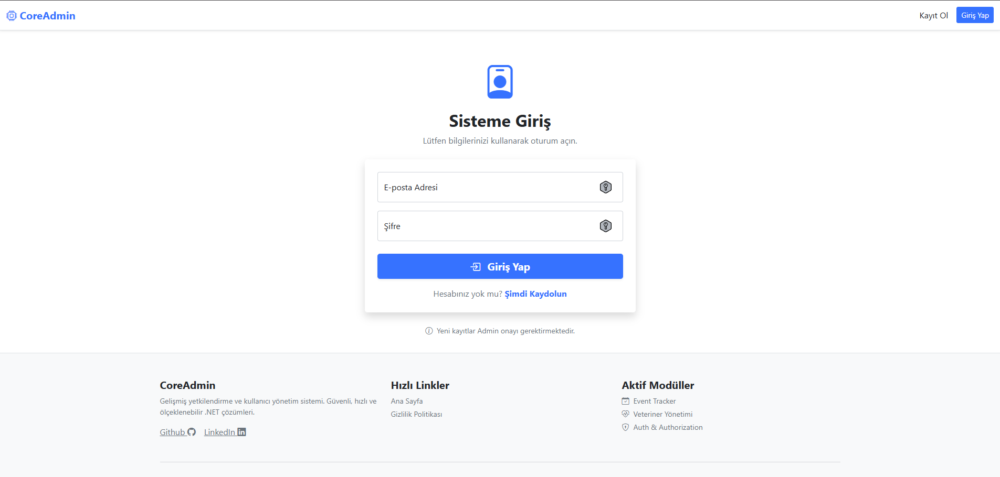
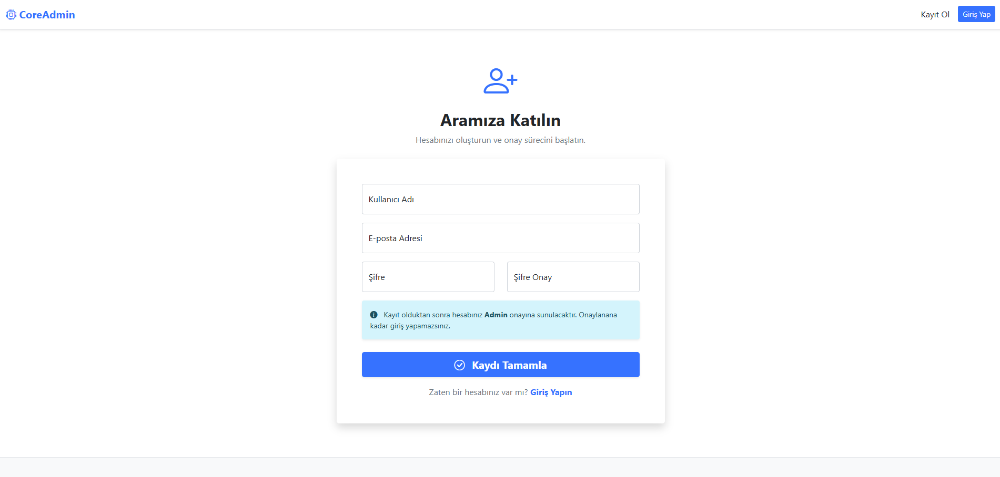
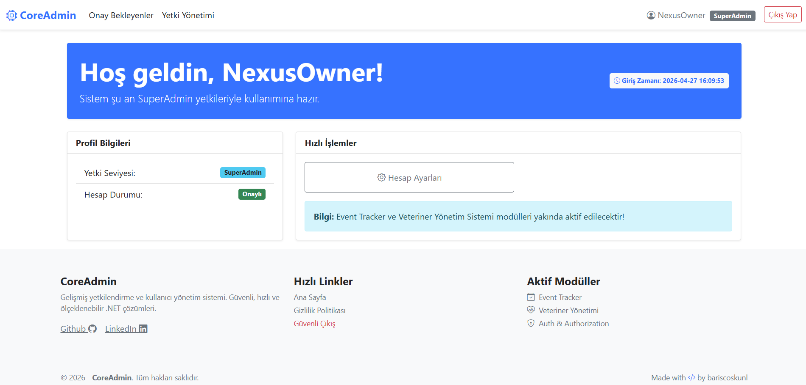
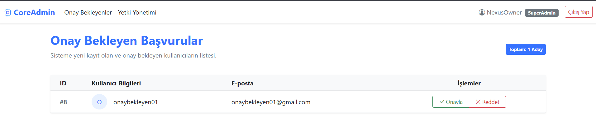
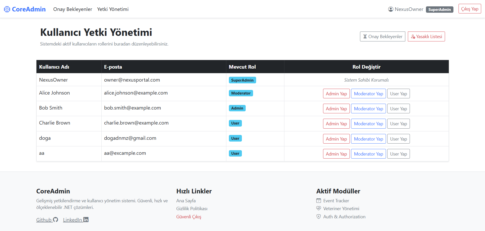
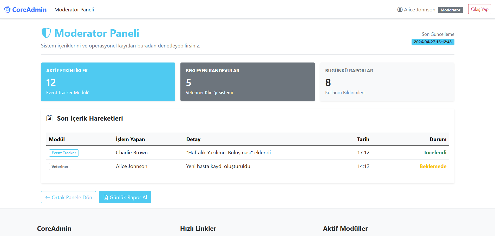
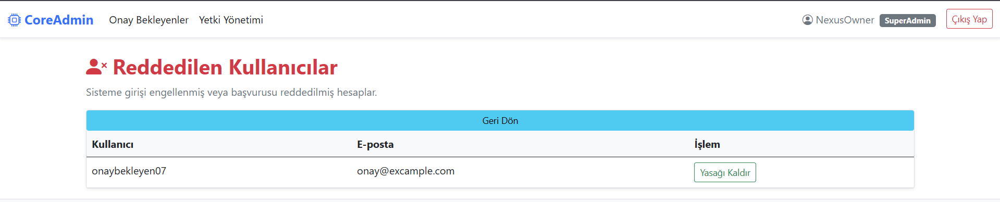

# 🚀 NexusPortal - CoreAdmin

**NexusPortal**, .NET 8 (LTS) ve Entity Framework Core teknolojileri üzerine inşa edilmiş, kurumsal seviyede projeler için modüler bir temel (Base) teşkil eden gelişmiş bir **Kullanıcı Yönetim ve Yetkilendirme Sistemi**dir.

Bu proje; karmaşık rol hiyerarşileri, kullanıcı onay süreçleri ve modern bir yönetim paneli ihtiyacını karşılamak üzere profesyonel bir iskelet sunar.

---

## ✨ Öne Çıkan Özellikler

* **🛡️ Gelişmiş Rol Hiyerarşisi:** `SuperAdmin`, `Admin`, `Moderator` ve `User` rollerini kapsayan, Claim-based yetkilendirme mimarisi.
* **⏳ Kullanıcı Onay İş Akışı:** Yeni kayıt olan kullanıcılar için "Bekleme Odası" mantığı; Admin onayı almadan sistem fonksiyonlarına erişim kısıtlanır.
* **🚫 Yasaklı Listesi (Blacklist):** Başvurusu reddedilen veya sistemden uzaklaştırılan kullanıcıların merkezi bir panelden yönetimi.
* **🎨 Dinamik Arayüz:** Kullanıcının yetki seviyesine göre (User.IsInRole) otomatik şekillenen Navbar ve Dashboard bileşenleri.
* **🌑 Modern Dark Mode:** Göz yormayan, profesyonel karanlık tema uyumluluğu.

---

## 📸 Ekran Görüntüleri

### 1. Kimlik Doğrulama ve Kayıt
Kullanıcı dostu arayüz ve kayıt sonrası otomatik başlayan Admin onay süreci.

  
  

### 2. Yönetim ve Onay Merkezi
Sistemin kalbi; bekleyen başvuruların değerlendirildiği ve rollerin düzenlendiği paneller.

  

  
  

### 3. Operasyonel Denetim ve Güvenlik
Moderatör paneli ve reddedilen kullanıcıların yönetildiği güvenlik ekranı.

  
  

---

## 🛠️ Teknik Stack

* **Framework:** ASP.NET Core MVC (v8.0 LTS)
* **ORM:** Entity Framework Core (v8.0)
* **Database:** Microsoft SQL Server
* **UI/UX:** Bootstrap 5, Bootstrap Icons, Razor Engine
* **Architecture:** Katmanlı Mimari (Controllers, Data/Entities, Models, Views)

---
